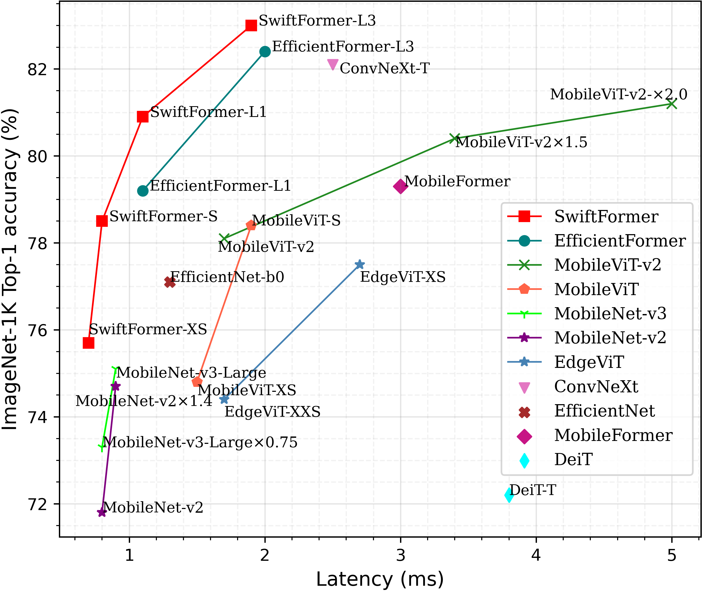
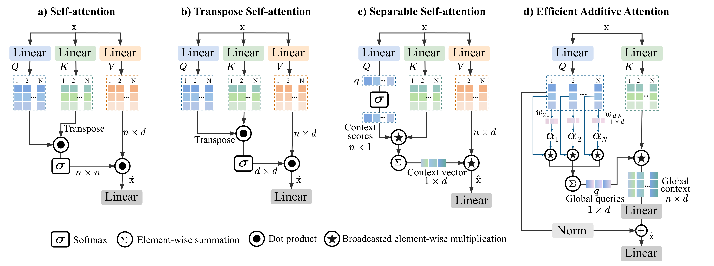
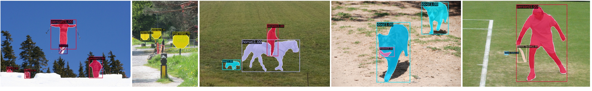
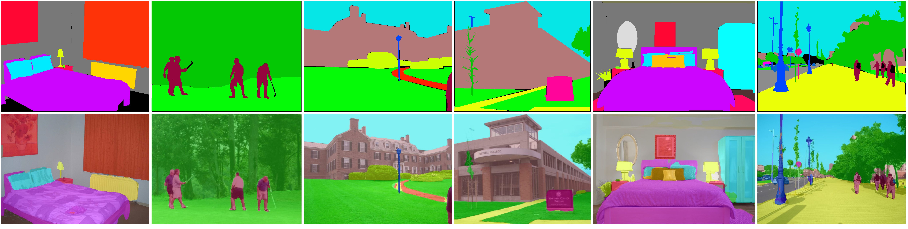

# SwiftFormer
### **SwiftFormer: Efficient Additive Attention for Transformer-based Real-time Mobile Vision Applications**


[Abdelrahman Shaker](https://scholar.google.com/citations?hl=en&user=eEz4Wu4AAAAJ)<sup>*1</sup>, [Muhammad Maaz](https://scholar.google.com/citations?user=vTy9Te8AAAAJ&hl=en&authuser=1&oi=sra)<sup>1</sup>, [Hanoona Rasheed](https://scholar.google.com/citations?user=yhDdEuEAAAAJ&hl=en&authuser=1&oi=sra)<sup>1</sup>, [Salman Khan](https://salman-h-khan.github.io/)<sup>1</sup>, [Ming-Hsuan Yang](https://scholar.google.com/citations?user=p9-ohHsAAAAJ&hl=en)<sup>2,3</sup> and [Fahad Shahbaz Khan](https://scholar.google.es/citations?user=zvaeYnUAAAAJ&hl=en)<sup>1,4</sup>

Mohamed Bin Zayed University of Artificial Intelligence<sup>1</sup>, University of California Merced<sup>2</sup>, Google Research<sup>3</sup>, Linkoping University<sup>4</sup>
<!-- [](site_url) -->
[](https://openaccess.thecvf.com/content/ICCV2023/papers/Shaker_SwiftFormer_Efficient_Additive_Attention_for_Transformer-based_Real-time_Mobile_Vision_Applications_ICCV_2023_paper.pdf)
<!-- [](youtube_link) -->
<!-- [](presentation) -->

## :rocket: News
* **(Jul 14, 2023):** SwiftFormer has been accepted at ICCV 2023. :fire::fire:
* **(Mar 27, 2023):** Classification training and evaluation codes along with pre-trained models are released.

<hr />

<p align="center">
   <br>
  Comparison of our SwiftFormer Models with state-of-the-art on ImgeNet-1K. The latency is measured on iPhone 14 Neural Engine (iOS 16).
</p>

<p align="center">
   <br>
</p>
<p align="left">
  Comparison with different self-attention modules. (a) is a typical self-attention. (b) is the transpose self-attention, where the self-attention operation is applied across channel feature dimensions (d×d) instead of the spatial dimension (n×n). (c) is the separable self-attention of MobileViT-v2, it uses element-wise operations to compute the context vector from the interactions of Q and K matrices. Then, the context vector is multiplied by V matrix to produce the final output. (d) Our proposed efficient additive self-attention. Here, the query matrix is multiplied by learnable weights and pooled to produce global queries. Then, the matrix K is element-wise multiplied by the broadcasted global queries, resulting the global context representation.
</p>

<details>
  <summary>
  <font size="+1">Abstract</font>
  </summary>
Self-attention has become a defacto choice for capturing global context in various vision applications. However, its quadratic computational complexity with respect to image resolution limits its use in real-time applications, especially for deployment on resource-constrained mobile devices. Although hybrid approaches have been proposed to combine the advantages of convolutions and self-attention for a better speed-accuracy trade-off, the expensive matrix multiplication operations in self-attention remain a bottleneck. In this work, we introduce a novel efficient additive attention mechanism that effectively replaces the quadratic matrix multiplication operations with linear element-wise multiplications. Our design shows that the key-value interaction can be replaced with a linear layer without sacrificing any accuracy. Unlike previous state-of-the-art methods, our efficient formulation of self-attention enables its usage at all stages of the network. Using our proposed efficient additive attention, we build a series of models called "SwiftFormer" which achieves state-of-the-art performance in terms of both accuracy and mobile inference speed. Our small variant achieves 78.5% top-1 ImageNet-1K accuracy with only 0.8~ms latency on iPhone 14, which is more accurate and 2x faster compared to MobileViT-v2.
</details>

<br>


## Classification on ImageNet-1K

### Models

| Model | Top-1 accuracy | #params | GMACs | Latency | Ckpt | CoreML|
|:---------------|:----:|:---:|:--:|:--:|:--:|:--:|
| SwiftFormer-XS |   75.7%    |     3.5M    |   0.6G   |      0.7ms     |  [XS](https://drive.google.com/file/d/12RchxzyiJrtZS-2Bur9k4wcRQMItA43S/view?usp=sharing)    |   [XS](https://drive.google.com/file/d/1bkAP_BD6CdDqlbQsStZhLa0ST2NZTIvH/view?usp=sharing)    |
| SwiftFormer-S  |   78.5%    |     6.1M    |   1.0G   |      0.8ms     |   [S](https://drive.google.com/file/d/1awpcXAaHH38WaHrOmUM8updxQazUZ3Nb/view?usp=sharing)   |   [S](https://drive.google.com/file/d/1qNAhecWIeQ1YJotWhbnLTCR5Uv1zBaf1/view?usp=sharing)    |
| SwiftFormer-L1 |   80.9%   |    12.1M   |   1.6G   |      1.1ms     |   [L1](https://drive.google.com/file/d/1SDzauVmpR5uExkOv3ajxdwFnP-Buj9Uo/view?usp=sharing)   |   [L1](https://drive.google.com/file/d/1CowZE7-lbxz93uwXqefe-HxGOHUdvX_a/view?usp=sharing)    |
| SwiftFormer-L3 |   83.0%   |    28.5M    |   4.0G   |      1.9ms     |  [L3](https://drive.google.com/file/d/1DAxMe6FlnZBBIpR-HYIDfFLWJzIgiF0Y/view?usp=sharing)    |   [L3](https://drive.google.com/file/d/1SO3bRWd9oWJemy-gpYUcwP-B4bJ-dsdg/view?usp=sharing)   |


## Detection and Segmentation Qualitative Results

<p align="center">
   <br>
</p>
<p align="center">
   <br>
</p>

## Latency Measurement

The latency reported in SwiftFormer for iPhone 14 (iOS 16) uses the benchmark tool from [XCode 14](https://developer.apple.com/videos/play/wwdc2022/10027/).

### SwiftFormer meets Android

Community-driven results with [Samsung Galaxy S23 Ultra, with Qualcomm Snapdragon 8 Gen 2](https://www.qualcomm.com/snapdragon/device-finder/samsung-galaxy-s23-ultra):

1. [Export](https://github.com/escorciav/SwiftFormer/blob/main-v/export.py) & profiler results of [`SwiftFormer_L1`](./models/swiftformer.py):

    | QNN            | 2.16 | 2.17  | 2.18   |
    | -------------- | -----| ----- | ------ |
    | Latency (msec) | 2.63 | 2.26  | 2.43   |

2. [Export](https://github.com/escorciav/SwiftFormer/blob/main-v/export_block.py) & profiler results of SwiftFormerEncoder block:

    | QNN            | 2.16 | 2.17  | 2.18   |
    | -------------- | -----| ----- | ------ |
    | Latency (msec) | 2.17 | 1.69  | 1.7    |

    Refer to the script above for details of the input & block parameters.

❓ _Interested in reproducing the results above?_

Refer to [Issue #14](https://github.com/Amshaker/SwiftFormer/issues/14) for details about [exporting & profiling.](https://github.com/Amshaker/SwiftFormer/issues/14#issuecomment-1883351728)

## ImageNet

### Prerequisites
`conda` virtual environment is recommended.

```shell
conda create --name=swiftformer python=3.9
conda activate swiftformer

pip install torch==1.11.0+cu113 torchvision==0.12.0+cu113 --extra-index-url https://download.pytorch.org/whl/cu113
pip install timm
pip install coremltools==5.2.0
```

### Data Preparation

Download and extract ImageNet train and val images from http://image-net.org. The training and validation data are expected to be in the `train` folder and `val` folder respectively:
```
|-- /path/to/imagenet/
    |-- train
    |-- val
```

### Single-machine multi-GPU training

We provide training script for all models in `dist_train.sh` using PyTorch distributed data parallel (DDP).

To train SwiftFormer models on an 8-GPU machine:

```
sh dist_train.sh /path/to/imagenet 8
```

Note: specify which model command you want to run in the script. To reproduce the results of the paper, use 16-GPU machine with batch-size of 128 or 8-GPU machine with batch size of 256. Auto Augmentation, CutMix, MixUp are disabled for SwiftFormer-XS, and CutMix, MixUp are disabled for SwiftFormer-S.

### Multi-node training

On a Slurm-managed cluster, multi-node training can be launched as

```
sbatch slurm_train.sh /path/to/imagenet SwiftFormer_XS
```

Note: specify slurm specific parameters in `slurm_train.sh` script.

### Testing

We provide an example test script `dist_test.sh` using PyTorch distributed data parallel (DDP).
For example, to test SwiftFormer-XS on an 8-GPU machine:

```
sh dist_test.sh SwiftFormer_XS 8 weights/SwiftFormer_XS_ckpt.pth
```

## Citation
if you use our work, please consider citing us:
```BibTeX
@InProceedings{Shaker_2023_ICCV,
    author    = {Shaker, Abdelrahman and Maaz, Muhammad and Rasheed, Hanoona and Khan, Salman and Yang, Ming-Hsuan and Khan, Fahad Shahbaz},
    title     = {SwiftFormer: Efficient Additive Attention for Transformer-based Real-time Mobile Vision Applications},
    booktitle = {Proceedings of the IEEE/CVF International Conference on Computer Vision (ICCV)},
    year      = {2023},
}
```

## Contact:
If you have any questions, please create an issue on this repository or contact at abdelrahman.youssief@mbzuai.ac.ae.


## Acknowledgement
Our code base is based on [LeViT](https://github.com/facebookresearch/LeViT) and [EfficientFormer](https://github.com/snap-research/EfficientFormer) repositories. We thank the authors for their open-source implementation.

I'd like to express my sincere appreciation to [Victor Escorcia](https://github.com/escorciav) for measuring & reporting the latency of SwiftFormer on Android (Samsung Galaxy S23 Ultra, with Qualcomm Snapdragon 8 Gen 2). Check [SwiftFormer Meets Android](https://github.com/escorciav/SwiftFormer) for more details!

## Our Related Works

- EdgeNeXt: Efficiently Amalgamated CNN-Transformer Architecture for Mobile Vision Applications, CADL'22, ECCV. [Paper](https://arxiv.org/abs/2206.10589) | [Code](https://github.com/mmaaz60/EdgeNeXt).
